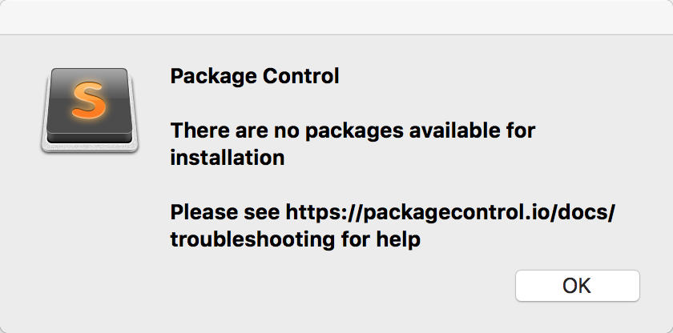
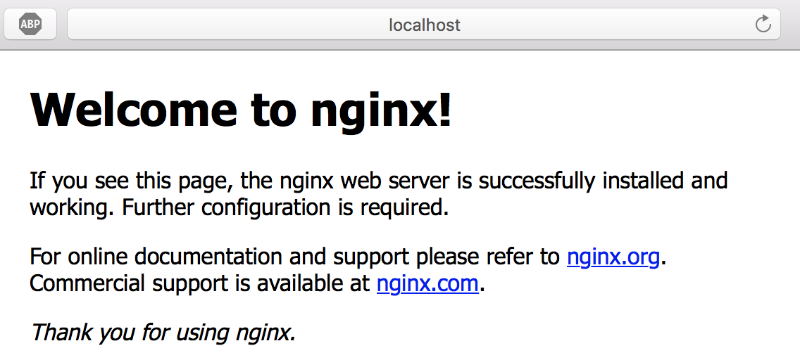
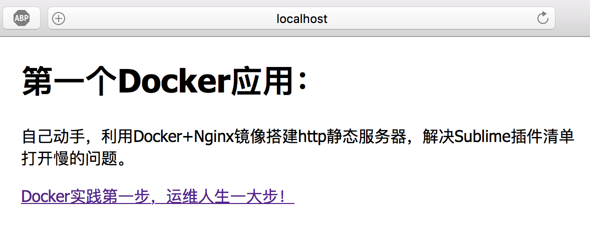
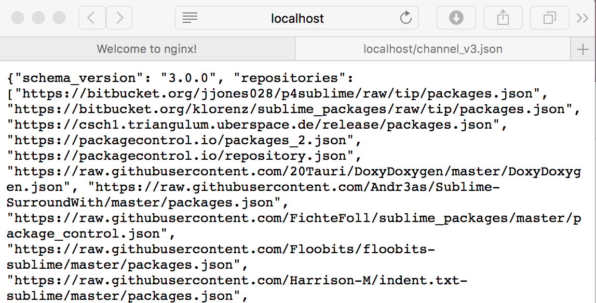
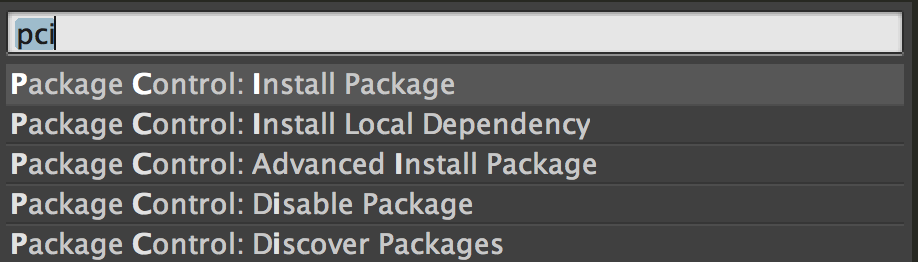
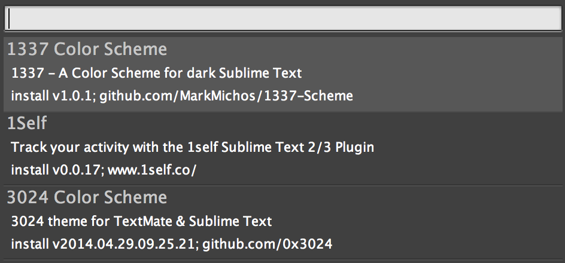

# Docker+Nginx镜像解决Sublime插件清单打开慢的问题

[TOC]

# 概要

敲pci命令时等了半天却报错，天朝你懂的：

 

```shell
Package Control
There are no packages available for installation
Please see https://packagecontrol.io/docs/troubleshooting for help
```

这里有一篇建立本地服务器来解决这个问题的思路[^注释1]，作者用的是python起了一个SimpleHTTPServer。我想，正好最近在学习Docker，能不能实践一下。有了本篇笔记。

[^注释1]: [解决sublime package control 出现There are no packages available for installation](http://www.jianshu.com/p/a3af44257b15)

## 环境准备：

书接上回：[Docker的第一次亲密接触](https://my.oschina.net/hexie/blog/785315)

### 要点：

+ 安装Docker for Mac，参考官方文档[Getting Started with Docker for Mac](https://docs.docker.com/docker-for-mac/?spm=5176.100239.blogcont57215.8.7BWQx6#/getting-started-with-docker-for-mac)

+ 创建&&启动Ngnix

```shell
  ChinaDreams:~ kangcunhua$ docker run -d -p 80:80 --name webserver nginx
  Unable to find image 'nginx:latest' locally
  latest: Pulling from library/nginx
  43c265008fae: Pull complete 
  e4c030a565b1: Pull complete 
  685b7631c1ce: Pull complete 
  Digest: sha256:dedbce721065b2bcfae35d2b0690857bb6c3b4b7dd48bfe7fc7b53693731beff
  Status: Downloaded newer image for nginx:latest
  30a5b7c29d54c91e0107ba305601dc019bd2dab4251dd250b37d76c41fe4062f
```

# Let's go

## 写个测试的首页

```html
<!DOCTYPE html>
<html>
  <head>
  	<title>Welcome to nginx!</title>
  	<meta http-equiv="Content-Type" content="text/html; charset=utf-8">
	<style>
	    body {
	        width: 35em;
	        margin: 0 auto;
	        font-family: Tahoma, Verdana, Arial, sans-serif;
	    }
	</style>
  </head>
  <body>
  	<h1>第一个Docker应用：</h1>
    <p>自己动手，利用Docker+Nginx镜像搭建http静态服务器，解决Sublime插件清单打开慢的问题。</p>
    <a href="channel_v3.json" target="_blank">Docker实践第一步，运维人生一大步！</a>
  </body>
</html>
```

命名为index.html,保存在document目录；

## 启动Nginx


```SHELL
ChinaDreams:~ kangcunhua$ docker start webserver
webserver
```

## 来测试下

 

## 进入容器

```SHELL
ChinaDreams:~ kangcunhua$ docker ps
CONTAINER ID        IMAGE               COMMAND                  CREATED             STATUS              PORTS                         NAMES
70d241e335b5        nginx               "nginx -g 'daemon off"   34 hours ago        Up 5 seconds        0.0.0.0:80->80/tcp, 443/tcp   webserver
ChinaDreams:~ kangcunhua$ docker exec -it 70d241e335b5  /bin/bash
root@70d241e335b5:/# ls
bin  boot  dev	etc  home  lib	lib64  media  mnt  opt	proc  root  run  sbin  srv  sys  tmp  usr  var
```


## 查看Nginx的配置

因为第一次使用nginx，首先在/etc/nginx中找到了配置文件

```shell
root@70d241e335b5:/etc/nginx# more nginx.conf 
```

nginx.conf指向了

```shell
include /etc/nginx/conf.d/*.conf;
```

打开对应目录的default.conf，发现web根目录配置

```shell
location / {
        root   /usr/share/nginx/html;
        index  index.html index.htm;
    }
```

进入/usr/share/nginx/html，备份index.html

```shell
mv index.html index.html_wlecometonginx
```

上传之前，需要用到container id，可以通过docker ps命令查看（参见前文）

## 上传index.html

```shell
ChinaDreams:Documents kangcunhua$ docker cp index.html 70d241e335b5:/usr/share/nginx/html/ 
```

## 来，测试下

 

## 上传channel_v3.json

```shell
ChinaDreams:Documents kangcunhua$ docker cp channel_v3.json 70d241e335b5:/usr/share/nginx/html/ 
```

## 访问测试

 

# 配置sublime

## 默认仓库清单配置

首选项—>Package Settings—>Package Control—>Settings-Default

```xml
// A list of URLs that each contain a JSON file with a list of repositories.
	// The repositories from these channels are placed in order after the
	// repositories from the "repositories" setting
	"channels": [
		"https://packagecontrol.io/channel_v3.json"
	],
```

不要动默认的，我们在自定义配置中修改覆盖就是

## Setting-User

```xml
	//custome A list of URLs that each contain a JSON file with a list of repositories.
	"channels": [
		"http://localhost/channel_v3.json"
	]
```

## 看看秒开pci的效果吧

Shift+⌘+P

 

清单



# 总结

## 我们干了什么

+ 运行第一个docker
+ 第一次运行Nginx
+ 进入容器
+ copy文件
+ 退出容器
+ 查看一个静态网站的配置
+ 解决实际痛点一个：以本地http server缓存sublime 官方插件仓库列表；
+ 以战练兵，提高效率学习

## 下一步挑战：

+ 打包镜像，发布到dockerhub
+ 写个脚本，自动同步官方的channel_v3.json
+ 打包镜像，发布到dockerhub


# 参考

+ [支持HTTP2的cURL——基于Alpine的最小化Docker镜像](http://dockone.io/article/1653)
+ [docker深入1-导入导出images和container的方式](http://nosmoking.blog.51cto.com/3263888/1643510)
+ [docker-image container 基本操作 -常用命令](http://www.cnblogs.com/haoliansheng/p/5031279.html)
+ [Docker容器和主机如何互相拷贝传输文件](http://xiaorui.cc/2015/04/12/docker容器和主机如何互相拷贝传输文件/)
+ [Linux curl命令详解](http://www.cnblogs.com/scott19820130/p/6039558.html)