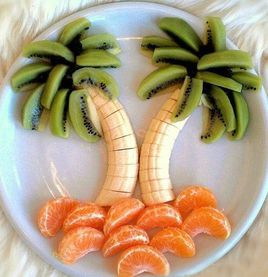

# 个人餐饮改善方案

[TOC]

# 营养理论

## 增肌的人，1斤体重至少需要摄入1g蛋白质

> 你好，鸡胸肉的蛋白质含量大概为30%，半斤鸡胸肉为250g，这么算来，半斤鸡胸肉含量为75g蛋白质。而对于一个增肌的人来说，1斤体重至少需要摄入1g蛋白质，如果你150斤，那么你就需要每天摄入150g蛋白质，肌肉才能生长。

> 1个鸡蛋大概是7g蛋白质，一勺蛋白粉大概能提供30g蛋白质。俗话说，三分练，七分吃，一个合理的饮食配上充分的锻炼和休息，才能让肌肉快速的生长。并且，在摄入蛋白质的时候，也要多吃青菜，青菜中的纤维素会有效的促进身体吸收蛋白质。

> 鸡胸肉和蛋白粉的虽然同为蛋白质，但是鸡胸肉从咀嚼，到胃的消化，然后是小肠的吸收，需要很长的过程，如果你刚锻炼完，需要快速补充蛋白质，还是需要一勺蛋白质粉，它能非常快的让身体吸收，给身体补充蛋白质。希望我的回答能够帮到你！

# 食材&食谱

## 西兰花

​	健身食谱无一例外的都会用西兰花这个绿色蔬菜。它富含多种人体生长所需的营养素，其中维生素C的含量更是超过了西红柿和辣椒，并且被认为是天然的抗癌蔬菜，“蔬菜皇冠”。每100g西兰花，热量33大卡，碳水含量4.3g，蛋白质含量4.1g。

1. 做法不要用刀切
   + 直接切会有很多小粒花朵散落，造成损失。建议用剪刀从花簇的根部连接处剪下，或者用手直接掰，这样可以保持花簇的完整。
2. 在盐水中浸泡15分钟
   + 能有效杀死花中残留的虫卵、小虫子，还有残留的农药。
3. 颜色越鲜艳营养价值越高
   + 当西兰花烹饪变成亮绿色的时候，其功营养效最强。

## 燕麦鸡胸肉饼

### 准备食材：

　　鸡胸肉1块
　　燕麦50g
　　鸡蛋1个
　　蔬菜（黄瓜、青椒、木耳）少许
　　调料（盐、黑胡椒粉）适量

### 详细步骤：

1. 鸡胸肉和蔬菜用搅拌机绞碎（如果没有搅拌机，就只有费点时间用刀切了）
2. 鸡胸肉、蔬菜、鸡蛋混合
3. 搅匀后加入调料
4. 加入燕麦搅拌均匀成糊状
5. 烤碗底部刷少许橄榄油，这个时候可以将烤箱预热到200℃
6. 将搅拌好的鸡胸肉倒入烤碗
7. 放入烤箱200℃，烤20~25分钟
8. 叮~

可直接在烤碗里吃，也可以取出切块，搭配其他蔬菜水果，作为午餐/晚餐是最好的选择。

### Tips：

　　1、每个烤箱的脾气不一样，烤的时候要时刻观察，避免烤过；
　　2、厨娘的烤碗比较小，没有烤出表面金黄的感觉，如果健友用披萨烤盘烤出来会更漂亮；
　　3、蔬菜调料随意搭配，做出属于你自己口味的燕麦鸡胸肉饼。

## 海南椰子树

##  

## 苹果切花

 

 